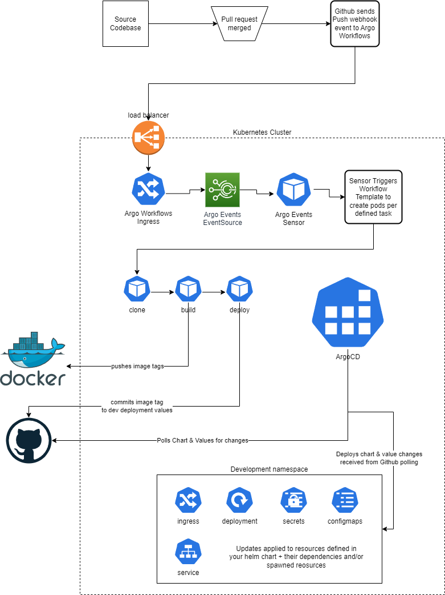

# Argo Workflows CI Chart

This chart contains configurable resources for defining CI and CD flows & processes.  The chart will deploy the following Kubernetes resources:
- ClusterWorkflowTemplate
    - Defines the steps for building and publishing our docker images
- EventSource
    - Defines the type of events we receive and handle as a source
        - eg. Github Inbound Webhook Events
    - Provides interface for configuring authentication to perform webhook creation etc.
- Sesnor
    - Essentially ties the event source and workflow template together
    - Defines the event source that would trigger a sensor to do something
    - Defines the target workflow operation that is kicked off by the specified events

# Prerequisites

1. (optional) Github App
2. Github Machine User or PAT
3. Dockerhub User w/ Push access
4. ArgoCD & Argo Workflows installation

# Deploy Workflows

1. Create Secrets

    ```bash
    # (optional) Prereq:  create github app
    kubectl create secret generic github-app \
        --from-literal=githubAppID="<app_id>" \
        --from-literal=githubAppInstallationID="<installation_id>" \
        --from-literal=githubAppPrivateKey="<private_key>" -n argocd

    # Prereq:  create github machine user and access token
    kubectl create secret generic github-machine-user \
        --from-literal=email="<example_email>" \
    	--from-literal=token="<example_token>" \
    	--from-literal=username="<example_user>" -n argocd

    # Prereq:  dockerhub user and token
    kubectl create secret docker-registry docker-push-user \
    	--docker-username="<example_user>" \
    	--docker-password="<example_password>" -n argocd
    ```


2. Populate `values.yaml`

    Overview of updating our values file:
    - (optional) Target our newly created github app secret
        - `github.githubApp.privateKey.name`
        - `github.githubApp.appID`
        - `github.githubApp.installationID`
    - Target our newly created github machine user secret
        - `github.machineUserToken.name`
    - Configure Github automated commits for CD
        - `github.automateCommits`
        - `github.deploymentRepository`
        - `github.deploymentFolderPath`
    - Target our newly created docker registry secret
        - `docker.secretName`
        - `docker.owner`
    - Specify the hostname for our inbound webhook from Github
    - Configure any necessary mapping between Github source repositories/branches to Docker target repositories
        - `githubRepoToDockerRepo`
            - This is a JSON object which will determine where image tags are pushed
            - Format & example:
                ```json
                {
                  "krum-web": {
                    "master": "krum-web",
                    "staging": "krum-web_staging",
                    "production": "krum-web_prod"
                  }
                }
                ```


3. Deploy

    Ensure there is an Event Bus installed to your Argo Workflows

    ```bash
    kubectl apply -n argocd -f https://raw.githubusercontent.com/argoproj/argo-events/stable/examples/eventbus/native.yaml
    ```

    It is important to install to the same namespace as your Argo installation

    ```bash
    helm upgrade --install argo-workflow-ci ./argo-workflow-ci -n argocd # --set github.automateCommits=true
    ```

    4. Add ingress path for our Github webhook path, point it to the `EventSource`'s generated service

    We will need to gather the following configurations:
    - Argo Workflows ingress name
    - Our desired workflows hostname
    - Our desired webhook path
    - Our desired webhook port
    - Our desired `EventSource` service name

    Once we have gathered those resources, we may plug them into our patch file `ingress-patch/ingress-patch.yaml`
    - `<workflows_host_name>`
    - `<webhook_path>`
    - `<event_source_svc_name>`
    - `<webhook_port>`

    ```bash
    kubectl patch ingress argo-workflows -n argocd --type merge --patch-file ./argo-workflows/ingress-patch/ingress-patch.yaml
    ```


# Diagram

